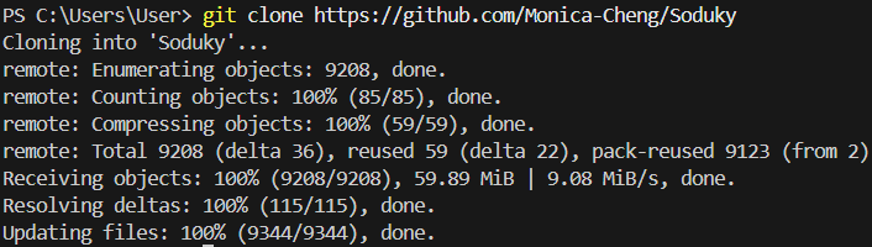
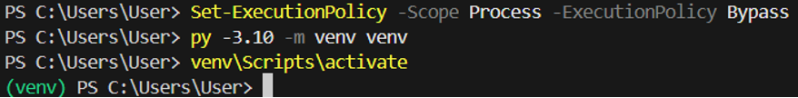
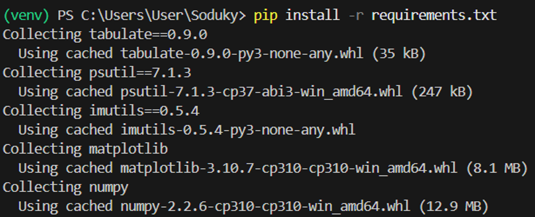
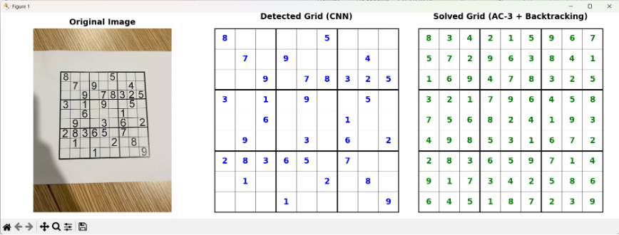
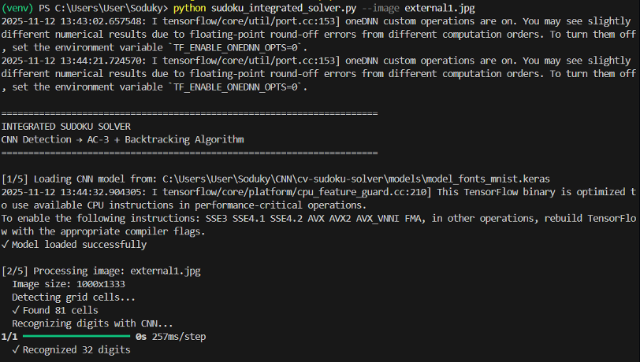
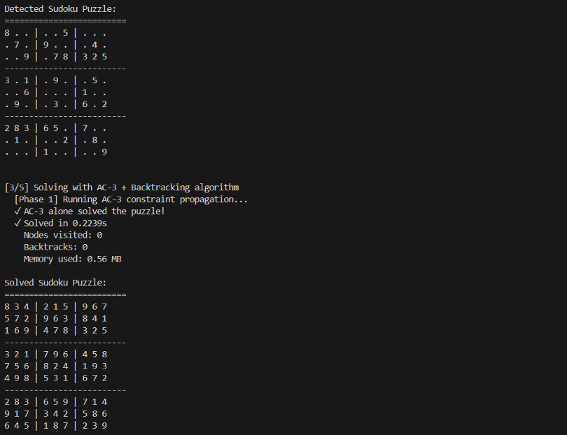
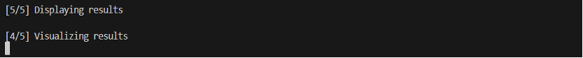

# Command to run algorithims

# Algorithm 1: Basic Backtracking (mon)

cd algo1
python3 algo1_run.py easy.txt medium.txt hard.txt

# Algorithm 2: Backtracking + Forward checking + MRV (Jasmine)

cd algo2
python3 algo2_run.py easy.txt medium.txt hard.txt

# Algorithm 3: AC-3 + FC + Heuristics (Jason)

cd algo3
python3 algo3_run.py easy.txt medium.txt hard.txt

# Algorithm 4: MIN CONFLICT (CINDY)

cd algo4
python3 algo4_run.py easy.txt medium.txt hard.txt

# To run cnn

python sudoku_main.py --img_fpath "data/sudoku_images/2.jpg" --output_path "recognized_sudoku.txt"

# To run ocr

python3 sudoku-ocr-Tesseract.py --image images/test.jpg --out recognized_sudoku.txt

# Git Hub sources and other resources

Algorithim 1: https://github.com/CharKeaney/sudoku-solver/blob/master/sudosolver.py

Algorithim 4:

1. https://doi.org/10.1016/0004-3702(92)90007-K

2. https://aima.cs.berkeley.edu/

3. https://github.com/kushjain/Min-Conflicts

Algorithim 3: https://github.com/stressGC/Python-AC3-Backtracking-CSP-Sudoku-Solver/tree/master

Algorithim 2: https://github.com/paccionesawyer/sudokuSolver-CSP

CNN: https://github.com/rg1990/cv-sudoku-solver
https://pyimagesearch.com/2020/08/10/opencv-sudoku-solver-and-ocr/

Run Combine File:
python sudoku_integrated_solver.py --image external1.jpg

1. Clone all the codes to your IDE
   Command: git clone https://github.com/Monica-Cheng/Soduky

2. Create virtual environment with python 3.10
   Commands:
   a. Set-ExecutionPolicy -Scope Process -ExecutionPolicy Bypass
   b. py -3.10 -m venv venv
   c. venv\Scripts\activate

3. Set up dependencies
   Commands: pip install -r requirements.txt

4. Run the main python script and passes your image as input
   Commands: python sudoku_integrated_solver.py --image external1.jpg
   Output:

